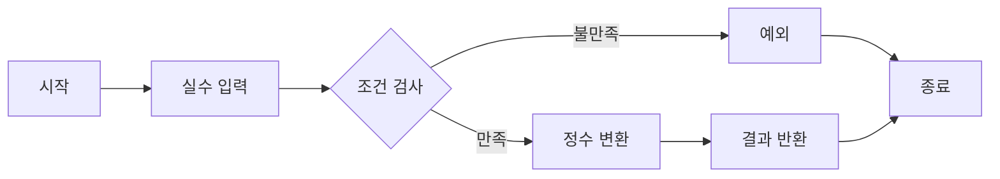

# 정수 부분

## 문제 설명
실수 flo가 매개 변수로 주어질 때, flo의 정수 부분을 return하는 함수를 구현합니다.

## 실행 방법
```bash
python solution.py
```

## 테스트 방법
```python
def test_solution():
    assert solution(1.42) == 1
    assert solution(69.32) == 69
    assert solution(0.0) == 0
    assert solution(100.0) == 100
    assert solution(42.0) == 42
```

## 알고리즘 순서도


## 성능 분석
- 시간 복잡도: O(1)
- 공간 복잡도: O(1)

## 개선 사항
- 현재 구현이 최적화되어 있어 추가 개선이 필요하지 않음
- Python의 내장 함수 int()를 사용하여 효율적인 처리 